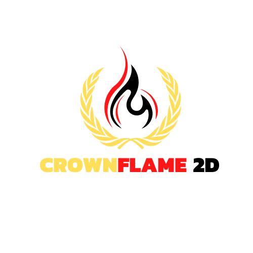

## CrownFlame 2D Custom Game Engine

<div align="center">
		
</div>

### About the Engine
The CrownFlame 2D Engine is being created to be a Cross Platform 2D Game Engine (Windows, Linux & MacOS) that is meant to be used for building 2D or 2.5D Role Playing Games (RPGs) with an easy to use API, and all the necessary modules included, such as Asset Creation & Importing, Vector Transformations, Animations, Audio,
Vertex & Fragment Shaders, Memory Management, Parallelization with CUDA and much more. This is a long term project. After this project is finished to a satisfactory level, my next step will be to build a 3D Game Engine version.

### Tech Stack
- C/C++
- OpenGL (Priority) (Cross Platform)
- DirectX12 (Windows Only)
- Vulkan (Cross Platform) (Overkill for 2D/2.5D, will be built at the end)
- GLFW (Window Creation & Management)
- GLM (Mathematic Library for Graphics & Shaders)
- CUDA (Overkill for 2D/2.5D unless the game created needs optimization, will be built at the end)
- CMake (Build Tool) (Cross Platform)

### 100% Completion Criteria - When the Game Engine is Finalized
- Modules Present:
	- Asset Creation & Importing
	- Vector Transformations Wrapper
	- Animations Support
	- Audio (Background & On Action)
	- Vertex & Fragment Shaders Support
	- Memory Management Included
	- Parallelization with Nvidia CUDA Library (For Optimization)
	- Networking (For Multiplayer Support)
- Cross Platform Build & Gameplay (Priority: In that order)
	- Windows 10/11
	- Linux
	- MacOS
- Controller Support (TBD)
- Demo Game showcasing every feature listed above

## 🎮 Game Features

### Core Gameplay
- **Player Character**: Control a green square (50x50 pixels) that represents your character
- **Large Explorable World**: Navigate a 2000x1500 pixel world that's much larger than the screen
- **Smooth Movement**: Delta-time based movement system for consistent gameplay across different frame rates
- **Collision Detection**: Advanced collision system prevents movement through obstacles

### Movement Systems
- **Keyboard Movement**: Traditional WASD/Arrow key controls for direct player movement
- **Intelligent Pathfinding**: Right-click anywhere to automatically move the player to that location
  - **Direct Line Movement**: Player moves in straight lines when path is clear
  - **Obstacle Avoidance**: Automatically navigates around walls and obstacles using A* pathfinding algorithm
  - **Smart Route Planning**: Calculates shortest safe path when direct route is blocked
  - **Visual Feedback**: Yellow destination marker shows where the player will move
  - **Safety Buffer**: 10-pixel buffer around obstacles prevents getting stuck against walls
  - **Consistent Speed**: Pathfinding uses same movement speed as keyboard controls
  - **Keyboard Override**: WASD keys immediately cancel pathfinding for manual control

### Enemy System
- **AI Enemies**: 7 pig enemies with intelligent movement patterns using `pig.png` sprite
- **4 Movement Patterns**:
  - **Horizontal Oscillation**: Enemies that move left and right
  - **Vertical Oscillation**: Enemies that move up and down  
  - **Circular Movement**: Enemies that rotate around a fixed center point
  - **Patrol System**: Enemies that move between two waypoints
- **Game Over Mechanic**: Touching any enemy triggers instant game over

### Camera System
- **Follow Camera**: Smooth camera that follows the player automatically
- **Configurable Speed**: Adjustable camera follow speed (1-20 scale)
- **Toggle Option**: Can enable/disable camera following
- **Screen-Space Rendering**: UI and overlays always visible regardless of camera position

### Object Types
- **Player (Green Square)**: Your controllable character
- **Obstacles (Red Rectangles)**: Static barriers in various sizes that block movement
- **Collectibles (Yellow Squares)**: Items that can be picked up by walking into them
- **Enemies (Pigs)**: Moving threats that end the game on contact

### Game World
- **Multiple Zones**: Large world with 9 obstacles and 12 collectibles spread across different areas
- **World Boundaries**: Player movement constrained to world limits (2000x1500)
- **Strategic Layout**: Objects placed to create interesting navigation challenges

### Tile-Based Environment System
- **Modular Tile Architecture**: Individual PNG tile loading system supporting multiple tile types
- **Flexible Tileset Management**: Load and organize tiles from separate image files
- **2D Grid Maps**: Large tile-based worlds with configurable dimensions
- **Intelligent Map Generation**: Procedural terrain creation with varied tile placement
- **Performance Optimized**: Viewport culling renders only visible tiles
- **Collision System Ready**: Tile properties support solid/walkable collision detection
- **Multiple Map Support**: Manage and switch between different tile maps
- **Extensible Design**: Easy to add new tilesets and tile types

### Scene/Level Management System
- **Scene-Based Architecture**: Complete level management with scenes containing all game objects
- **File-Based Scene Definition**: Load scenes from external `.scene` files for easy level creation
- **Programmatic Scene Creation**: Create scenes dynamically through code using SceneData structures
- **Scene Transitions**: Smooth transitions between levels with multiple effect types (fade, slide)
- **Auto-Progression**: Automatic scene transitions based on completion conditions
- **Scene Completion Triggers**: Flexible completion conditions (collect all items, defeat enemies, manual)
- **Persistent Scene Storage**: Save and load scenes to/from files for level editors
- **Hot-Swapping**: Change scenes without restarting the application
- **Scene Callbacks**: Event system for scene changes and transitions
- **Validation System**: Built-in validation for scene definitions and data integrity

### 🔥 Hot Reloading System
- **Asset Hot Reloading**: Automatically reload assets when files change on disk for faster iteration
- **Real-Time File Monitoring**: Background file watcher monitors assets every 500ms for changes
- **Multi-Asset Support**: Automatic detection and reloading of textures, scenes, and audio files
- **Scene Hot Reloading**: Instantly reload and restart scene files when modified externally
- **Audio Hot Reloading**: Update sound effects without restarting the engine
- **Smart Scene Detection**: Automatically reloads the current active scene if it's modified
- **Developer-Friendly UI**: In-game controls to enable/disable hot reloading and view watched files
- **Non-Intrusive Design**: Hot reload failures are logged but don't crash the application
- **File Type Auto-Detection**: Automatically determines asset type based on file extension
- **Registry System**: Tracks which assets are loaded and their file paths for efficient reloading

### 📦 Asset Management System
- **Centralized Asset Loading**: Unified system for managing all game assets (textures, audio, scenes, fonts)
- **Smart Memory Management**: Automatic loading, caching, and cleanup of assets
- **Multi-Format Support**: 
  - **Textures**: PNG, JPG, JPEG, BMP, TGA with pixelated and mipmapping options
  - **Audio**: MP3, WAV, OGG, FLAC integration with raudio
  - **Scenes**: .scene file format for level data
  - **Fonts**: TTF, OTF font loading with gl2d integration
- **Batch Operations**: Load entire directories of assets with filtering by type
- **Auto-Discovery**: Automatically scan and catalog assets in the resources/ folder
- **Asset Validation**: Verify asset integrity and detect missing files
- **Hot Reload Integration**: Seamless asset reloading during development
- **Memory Tracking**: Monitor asset usage and memory consumption
- **Asset Registry**: Complete catalog of available and loaded assets with metadata
- **Callback System**: Event notifications for asset loading success/failure
- **Priority Loading**: Asset priority system for optimized loading order

### Database System
- **SQLite Integration**: Persistent data storage using SQLite database
- **Automatic Database Creation**: Database and directory created automatically if they don't exist
- **Database Manager**: Centralized database connection management
- **PRAGMA Support**: Foreign key constraints enabled for data integrity

### Audio System
- **Sound Effects**: Dynamic audio feedback for game events
- **Collectible Pickup Sounds**: Audio cues when collecting yellow squares
- **Multi-Channel Playback**: Multiple sounds can play simultaneously
- **Volume Control**: Master volume and individual sound volume adjustment
- **Format Support**: MP3, WAV, OGG, FLAC, and tracker music formats

## 🎨 Visual Features

### User Interface
- **ImGui Integration**: Modern docking-enabled interface
- **Real-time Information**:
  - Player world coordinates
  - Camera position
  - Total object counts
  - Game state information
- **Interactive Controls**:
  - Movement speed slider (50-500 pixels/second)
  - Camera follow speed adjustment
  - Camera follow toggle
  - Restart game button

### Game Over System
- **Visual Banner**: Full-screen game over overlay with semi-transparent background
- **Professional Text**: TTF font rendering with Arial font (Windows systems)
- **Fallback Graphics**: Rectangle-based text for systems without fonts
- **Clear Instructions**: Multiple restart options clearly displayed
- **Proper Spacing**: Well-spaced text layout for optimal readability

## 🎯 Controls

### Movement
- **WASD Keys**: Primary movement controls
- **Arrow Keys**: Alternative movement controls
- **Right-Click**: Pathfinding movement - click anywhere to move the player to that location
- **ESC**: Exit game
- **R Key**: Restart game when game over

### UI Controls
- **Mouse**: Interact with UI sliders and buttons
- **Docking**: Drag UI panels to rearrange interface

### Hot Reload Controls
- **Hot Reload Panel**: Located in the Game Controls window under "🔥 Hot Reload" section
- **Enable Toggle**: Check/uncheck "Enable Hot Reloading" to activate the file monitoring system
- **Reload All Button**: Click "🔄 Reload All Assets" to manually trigger a full asset reload
- **Status Button**: Click "📊 Show Status" to print detailed file watching information to the console
- **Watched Files List**: Expand "Watched Files" to see all monitored assets and their paths

## 📦 Asset Manager Usage

### Quick Start
```cpp
// Get asset manager from application
AssetManager& assetManager = app.getAssetManager();

// Load individual assets
assetManager.loadTexture("player_sprite", "textures/sprites/player.png", true);
assetManager.loadAudio("jump_sound", "audio/jump.wav");
assetManager.loadScene("level1", "scenes/level1.scene");
assetManager.loadFont("ui_font", "fonts/arial.ttf");

// Use assets in your code
gl2d::Texture* playerTexture = assetManager.getTexture("player_sprite");
if (playerTexture) {
    renderer.renderRectangle(playerPos, *playerTexture);
}
```

### Batch Loading
```cpp
// Load all textures from a directory
assetManager.loadAssetsFromDirectory("textures/tiles/", AssetManager::AssetType::TEXTURE);

// Preload essential assets
std::vector<std::string> essentialAssets = {"player_sprite", "ground_tile", "menu_music"};
assetManager.preloadAssets(essentialAssets);
```

### Asset Information & Management
```cpp
// Check if assets are loaded
bool isLoaded = assetManager.isTextureLoaded("player_sprite");

// Get asset statistics
size_t totalAssets = assetManager.getAssetCount();
size_t textureCount = assetManager.getAssetCountByType(AssetManager::AssetType::TEXTURE);
size_t memoryUsage = assetManager.getTotalMemoryUsage();

// List all loaded assets
auto loadedAssets = assetManager.getLoadedAssets();
for (const auto& asset : loadedAssets) {
    std::cout << asset.name << " (" << asset.size << " bytes)" << std::endl;
}

// Validate assets
if (!assetManager.validateAllAssets()) {
    auto missingAssets = assetManager.getMissingAssets();
    // Handle missing assets...
}
```

### Hot Reloading with AssetManager
```cpp
// Enable hot reload
assetManager.enableHotReload(true);

// Set up asset load callbacks
assetManager.setAssetLoadCallback([](const std::string& name, AssetManager::AssetType type, bool success) {
    if (success) {
        std::cout << "Asset reloaded: " << name << std::endl;
    }
});

// In your game loop
assetManager.checkForAssetChanges();
```

## 🔄 Hot Reloading Developer Workflow

### Quick Start
1. **Launch the Game**: Start the application normally
2. **Enable Hot Reloading**: In the Game Controls window, check "Enable Hot Reloading"
3. **Modify Assets**: Edit any scene (`.scene`), audio (`.mp3`, `.wav`, `.ogg`), or texture files
4. **See Changes**: The engine automatically detects file changes and reloads them within ~500ms

### Supported Asset Types
- **Scene Files**: `.scene` files will be automatically reloaded and the current scene restarted if it's the one being modified
- **Audio Files**: `.mp3`, `.wav`, `.ogg` files will be reloaded and ready for immediate playback
- **Texture Files**: `.png`, `.jpg`, `.jpeg`, `.bmp`, `.tga` files (framework ready, implementation varies by texture usage)

### Development Tips
- **Scene Editing**: Edit scene files in any text editor, save, and watch the changes appear instantly
- **Audio Testing**: Replace audio files with different versions to test sound effects quickly
- **Non-Disruptive**: If a file has errors, the reload will fail gracefully without crashing the game
- **Performance**: File monitoring runs in a background thread and checks every 500ms
- **Console Output**: Watch the console for detailed information about what's being reloaded

## 🏗️ Technical Features

### Architecture
- **Object-Oriented Design**: Clean separation of concerns with dedicated classes
- **Modular Code Structure**:
  - `Application`: Main application lifecycle and coordination
  - `AssetManager`: Centralized asset loading and management system
  - `GameObject`: Base class for all game entities
  - `Enemy`: Specialized class for AI-controlled entities
  - `GameWorld`: World management and object coordination
  - `GameState`: Game state and flow control
  - `DatabaseManager`: SQLite database connection and management
  - `AudioManager`: Sound effect loading and playback management
  - `InputManager`: Input handling and processing
  - `UIManager`: User interface management
  - `FPSCounter`: Performance monitoring
  - `Pathfinder`: A* pathfinding algorithm implementation for intelligent navigation

### Database Features
- **SQLite Integration**: Embedded database for persistent storage
- **Connection Management**: Robust connection handling with proper cleanup
- **Error Handling**: Comprehensive error reporting for database operations
- **Foreign Key Support**: Enabled foreign key constraints for referential integrity
- **Directory Management**: Automatic creation of database directory structure

### Settings Management System
- **Monitor Persistence**: Game automatically restores to the monitor it was last closed on
- **Multi-Monitor Support**: Intelligent detection of which monitor contains the most window area
- **Window State Restoration**: Saves and restores window position and size
- **Configuration File**: Settings stored in `resources/settings.cfg` using simple key-value format
- **First-Run Detection**: Graceful handling of initial startup without saved settings
- **Safe Monitor Recovery**: Handles disconnected monitors by falling back to primary display
- **Automatic Settings Save**: Window state saved both on close and on application shutdown

### Audio Features
- **raudio Integration**: Powered by the raudio library for cross-platform audio
- **Sound Management**: Load, unload, and organize sounds by name
- **Playback Control**: Play, stop, pause, and resume individual sounds
- **Multi-Channel Support**: Overlapping sound effects with `playSoundMulti()`
- **Audio Properties**: Individual volume and pitch control per sound
- **Master Volume**: Global volume control for all audio
- **Non-Critical Operation**: Game continues if audio initialization fails
- **Multiple Format Support**: MP3, WAV, OGG, FLAC, XM, and MOD files

### Collision Detection
- **Rectangle-based Collision**: Efficient AABB (Axis-Aligned Bounding Box) detection
- **Separate Detection Systems**:
  - Player vs Obstacles (movement blocking)
  - Player vs Collectibles (item pickup)
  - Player vs Enemies (game over trigger)

### Rendering System
- **OpenGL-based Rendering**: Hardware-accelerated graphics using gl2d framework
- **Texture Support**: Sprite rendering for enemies using PNG assets
- **Layered Rendering**: Proper render order with overlays
- **Camera-relative Rendering**: All objects render correctly with camera movement

### Pathfinding System
- **A* Algorithm**: Industry-standard pathfinding with heuristic optimization
- **Grid-Based Navigation**: 25-pixel grid system for efficient path calculation
- **Intelligent Route Selection**: Attempts direct path first, falls back to A* when blocked
- **Collision-Aware**: Integrates with existing collision detection system
- **Safety Margins**: 10-pixel buffer around obstacles prevents collision issues
- **Visual Debugging**: Destination markers and path visualization
- **Performance Optimized**: Efficient grid representation and path caching
- **Mouse Integration**: Seamless right-click to move functionality

### Resource Management
- **Automatic Asset Loading**: Textures and fonts loaded on demand
- **Memory Management**: Smart pointers for safe object lifecycle
- **Resource Cleanup**: Proper cleanup of OpenGL resources

## 🛠️ Build System

### Requirements
- **Windows 10/11**: Primary target platform
- **Visual Studio 2022**: Recommended compiler
- **CMake 3.16+**: Build system generator
- **PowerShell**: For build scripts
- **C++17**: Modern C++ standard features

### Dependencies (Included)
- **GLFW 3.3.2**: Window management and input
- **GLAD**: OpenGL loader
- **GLM**: Mathematics library
- **gl2d**: 2D rendering framework
- **ImGui (Docking)**: User interface
- **STB Libraries**: Image and font loading
- **SQLite Amalgamation**: Database engine
- **raudio**: Audio system for sound effects and music

### Building
```powershell
# Simple build and run
.\build_and_run.ps1

# Manual build
mkdir build
cd build
cmake -G "Visual Studio 17 2022" -A x64 ..
cmake --build . --config Release
```

## 📁 Project Structure

```
📦 Game Project
├── 📂 include/              # Header files
│   ├── Application.h        # Main application class
│   ├── AudioManager.h       # Audio system management
│   ├── DatabaseManager.h    # Database connection management
│   ├── Enemy.h             # Enemy AI system
│   ├── FileBrowser.h       # Cross-platform file browser and dialogs
│   ├── FPSCounter.h        # Performance monitoring
│   ├── GameObject.h        # Base game object class
│   ├── GameState.h         # Game state management
│   ├── GameWorld.h         # World management
│   ├── InputManager.h      # Input handling
│   ├── openglErrorReporting.h # OpenGL debugging
│   ├── Pathfinder.h        # A* pathfinding algorithm
│   ├── Scene.h             # Individual scene/level management
│   ├── SceneData.h         # Scene data structures and definitions
│   ├── SceneManager.h      # Scene loading, transitions, and management
│   ├── SceneTemplates.h    # Professional scene template system
│   ├── SceneValidator.h    # Scene validation and quality assurance
│   ├── Tile.h              # Individual tile representation
│   ├── TileMap.h           # 2D tile grid management
│   ├── TileMapManager.h    # Tileset and map management
│   ├── Tileset.h           # Tile collection management
│   └── UIManager.h         # User interface management
├── 📂 src/                 # Source files
│   ├── Application.cpp     # Main application implementation
│   ├── AudioManager.cpp    # Audio system implementation
│   ├── DatabaseManager.cpp # Database operations
│   ├── Enemy.cpp           # Enemy AI implementation
│   ├── FileBrowser.cpp     # Cross-platform file operations
│   ├── FPSCounter.cpp      # Performance monitoring
│   ├── GameObject.cpp      # Object implementation
│   ├── GameState.cpp       # State management
│   ├── GameWorld.cpp       # World management logic
│   ├── InputManager.cpp    # Input processing
│   ├── main.cpp            # Application entry point
│   ├── openglErrorReporting.cpp # OpenGL error handling
│   ├── Pathfinder.cpp      # A* pathfinding implementation
│   ├── Scene.cpp           # Scene management implementation
│   ├── SceneExample.cpp    # Example usage of the scene system
│   ├── SceneManager.cpp    # Scene manager implementation
│   ├── SceneTemplates.cpp  # Scene template implementations
│   ├── SceneValidator.cpp  # Scene validation system
│   ├── Tile.cpp            # Tile implementation
│   ├── TileMap.cpp         # Tile map implementation
│   ├── TileMapManager.cpp  # Tile system management
│   ├── Tileset.cpp         # Tileset implementation
│   └── UIManager.cpp       # UI implementation
├── 📂 database/            # Database storage (created automatically)
├── 📂 resources/           # Game assets
│   ├── 📂 tiles/          # Individual tile assets (64x64 PNG files)
│   └── 📂 scenes/         # Scene definition files (.scene format)
├── 📂 thirdparty/         # External libraries (not documented here)
├── CMakeLists.txt         # Build configuration
├── build_and_run.ps1      # PowerShell build script
└── build_and_run.bat      # Batch build script
└── .clangd                # Clang Config to handle linting errors
└── compile_flags.txt      # Compilation Flags Config
```

## 🎲 Gameplay Tips

1. **Explore Safely**: Use obstacles as cover while navigating around enemies
2. **Collect Items**: Yellow squares are safe to collect - they don't move and play a satisfying pickup sound
3. **Watch Enemy Patterns**: Learn each enemy's movement to navigate safely
4. **Use Camera**: Adjust camera follow speed for your preferred play style
5. **Plan Routes**: The large world allows for multiple paths to objectives
6. **Audio Cues**: Listen for sound effects that provide feedback on your actions

## 🔄 Game States

- **Playing**: Normal gameplay with full movement and interaction
- **Game Over**: Triggered by enemy contact, disables player movement
- **Restart**: Reset world state and return to playing

## 💾 Database System

### Database Features
- **Automatic Setup**: Database and directory structure created on first run
- **SQLite Integration**: Lightweight, embedded database solution
- **Connection Management**: Proper connection lifecycle with error handling
- **File Location**: Database stored in `database/` directory

### Database Manager API
```cpp
DatabaseManager dbManager;
bool success = dbManager.initialize("database/game.db");
if (dbManager.isConnected()) {
    // Database operations here
}
dbManager.close();
```

## 🎬 Scene Management System

### Scene System Features
The Scene Management System provides a complete solution for creating, managing, and transitioning between game levels:

- **Hierarchical Scene Structure**: Each scene contains all game objects, settings, and metadata
- **File-Based Level Creation**: Create levels using simple text-based `.scene` files
- **Programmatic Scene Creation**: Build scenes dynamically through code
- **Transition Effects**: Fade, slide, and instant transitions between scenes
- **Auto-Progression**: Scenes can automatically advance based on completion conditions
- **Scene Persistence**: Save and load scenes for level editors and procedural generation

### ✅ Advanced Scene Management Features

The engine now includes 4 professional-grade scene management tools integrated directly into the UI:

#### 🔧 1. File Browser - Cross-Platform File Management
- **Native OS Integration**: Platform-specific file dialogs for Windows, Linux, and macOS
- **Smart Directory Browsing**: Automatic scene directory detection and navigation
- **File Information Display**: Shows file sizes, paths, and tooltips with detailed information
- **Auto-Refresh Capability**: Dynamic scene list updates when files are added or modified
- **Scene File Filtering**: Automatically filters and displays only `.scene` files
- **Instant Loading**: Click any scene file to load and switch immediately

#### 📊 2. Scene Information Display - Real-Time Scene Analytics
- **Comprehensive Scene Details**: View name, description, world dimensions, and transition settings
- **Live Object Counts**: Real-time display of total objects, obstacles, collectibles, and enemies
- **Visual Organization**: Clean, organized layout with icons and separators
- **Integration Ready**: Seamlessly connects with validation system for quality assurance
- **Performance Metrics**: Instant feedback on scene complexity and content

#### 🎨 3. Scene Templates - Rapid Prototyping System
- **8 Professional Templates**: 
  - **Empty**: Clean slate for custom creation
  - **Tutorial**: Beginner-friendly layout with basic obstacles
  - **Maze**: Complex navigation challenges with strategic walls
  - **Arena**: Combat-focused circular battleground
  - **Platformer**: Vertical challenges with jumping mechanics
  - **Collection Challenge**: Optimized for collectible gameplay
  - **Enemy Gauntlet**: Action-packed with multiple enemy types
  - **Obstacle Course**: Precision navigation training
- **Template Previews**: Detailed descriptions and previews before creation
- **Customizable Names**: Set custom scene names during template creation
- **Instant Creation**: Generate complete scenes with proper object placement
- **Save Integration**: Create and save templates directly to files

#### ✅ 4. Scene Validation - Quality Assurance System
- **Comprehensive Validation Engine**: Multi-category scene integrity checking
- **Error Classification**: Separate error and warning systems with severity levels
- **Validation Categories**:
  - **Basic Properties**: Scene name, description, and metadata validation
  - **World Settings**: Dimension and boundary checks
  - **Player Spawn**: Spawn point validation and accessibility
  - **Object Placement**: Obstacle, collectible, and enemy positioning
  - **Collision Detection**: Object overlap and intersection analysis
  - **Reachability Analysis**: Path validation and accessibility testing
- **Visual Results Display**: Color-coded issue reporting with location-specific feedback
- **Location-Specific Feedback**: Precise error locations for quick fixes

### 🚀 How to Use the Advanced Features

The new scene management tools are seamlessly integrated into the existing UI with intuitive controls:

- **📁 File Browser Button**: Opens native file dialogs and directory browser
- **📋 Templates Button**: Access professional scene templates for rapid creation
- **ℹ️ Scene Info Button**: View comprehensive scene information and statistics
- **✅ Validate Button**: Run complete scene validation with detailed reporting
- **🔄 Refresh Button**: Manually refresh scene list to detect new files

### 💡 Key Benefits

- **Immediate Productivity**: File browser eliminates manual path typing and file searching
- **Rapid Prototyping**: Templates enable instant scene creation for quick testing and iteration
- **Quality Assurance**: Validation system prevents common scene errors before they cause issues
- **Enhanced User Experience**: Rich scene information provides instant feedback and insights
- **Professional Workflow**: Native OS integration creates a polished, professional development experience
- **Dynamic Scene Management**: Automatic detection and loading of scene files from the directory

### Scene File Format
Scene files use a simple INI-style format:

```ini
[SCENE]
name=Level 1 - Tutorial
description=A simple tutorial level
nextScene=level2
transitionTrigger=collectibles_complete

[WORLD]
width=2000.0
height=1500.0
backgroundMusic=background.mp3

[CAMERA]
followSpeed=5.0
followEnabled=true

[PLAYER]
spawnX=100.0
spawnY=100.0

[OBSTACLES]
300.0,200.0,80.0,80.0
500.0,300.0,60.0,120.0

[COLLECTIBLES]
450.0,150.0
150.0,250.0

[ENEMIES]
400.0,300.0,0,100.0  # x,y,pattern,speed
```

### Scene Manager API
```cpp
// Initialize scene manager
Application app;
SceneManager& sceneManager = app.getSceneManager();

// Load scenes from files
app.loadScene("level1", "resources/scenes/level1.scene");
app.loadScene("level2", "resources/scenes/level2.scene");

// Create scenes programmatically
SceneData::SceneDefinition customScene("Custom Level");
customScene.obstacles.emplace_back(100, 100, 50, 50);
customScene.collectibles.emplace_back(200, 200);
app.loadSceneFromDefinition("custom", customScene);

// Change scenes with transitions
SceneData::SceneTransition fadeTransition(
    SceneData::TransitionType::FADE_TO_BLACK, 2.0f);
sceneManager.changeScene("level2", fadeTransition);

// Instant scene change
sceneManager.changeSceneInstant("level1");

// Scene callbacks
sceneManager.setOnSceneChangedCallback([](const std::string& sceneName) {
    std::cout << "Changed to scene: " << sceneName << std::endl;
});
```

### Movement Patterns for Enemies
- **0 (HORIZONTAL)**: Move left and right
- **1 (VERTICAL)**: Move up and down
- **2 (CIRCULAR)**: Move in a circle around a center point
- **3 (PATROL)**: Move between two waypoints

### Scene Completion Triggers
- **collectibles_complete**: Scene completes when all collectibles are gathered
- **enemies_defeat**: Scene completes when all enemies are eliminated
- **manual**: Scene completion is controlled manually through code

### Example Scene Usage
```cpp
// In your main application setup
void setupGameScenes(Application& app) {
    // Load levels from files
    app.loadScene("tutorial", "resources/scenes/tutorial.scene");
    app.loadScene("level1", "resources/scenes/level1.scene");
    app.loadScene("boss", "resources/scenes/boss_fight.scene");
    
    // Start with tutorial
    app.changeScene("tutorial");
}
```

## 🔊 Audio System

### Audio Features
- **Automatic Initialization**: Audio system starts with the application
- **Sound Effect Integration**: Dynamic audio feedback for game events
- **Multi-Format Support**: Supports MP3, WAV, OGG, FLAC, XM, and MOD files
- **Sound Library**: Centralized sound loading and management by name
- **Non-Critical Operation**: Game continues gracefully if audio fails to initialize

### Sound Effects
- **Collectible Pickup**: Plays audio feedback when collecting yellow squares
- **Multi-Channel Playback**: Multiple sounds can overlap without cutting each other off
- **Volume Control**: Adjustable master volume and individual sound levels

### AudioManager API
```cpp
AudioManager audioManager;
audioManager.initialize();

// Load sounds
audioManager.loadSound("collectible_pickup", "resources/audio/collectible_pickup.mp3");

// Play sounds
audioManager.playSound("pickup");           // Single playback
audioManager.playSoundMulti("pickup");      // Multi-channel playback

// Control playback
audioManager.setMasterVolume(0.8f);
audioManager.setSoundVolume("pickup", 0.5f);
```

### Audio File Requirements
- **File Location**: Place audio files in the `resources/audio/` directory
- **Collectible Sound**: Requires `collectible_pickup.mp3` for pickup sound effects
- **Recommended Formats**: MP3 for compatibility, WAV for low latency

### Resource Directory Structure
The project organizes resources into the following structure:
- `resources/audio/` - Audio files (sound effects, music)
- `resources/textures/` - All texture files
  - `resources/textures/sprites/` - Character and object sprites (e.g., pig.png)
  - `resources/textures/tiles/` - Tile textures for the tile system
- `resources/scenes/` - Scene definition files

## 🚀 Future Enhancement Possibilities

The codebase is designed for extensibility:
- **Database Usage**: Store player progress, high scores, and game statistics
- **Enhanced Audio**: Background music, enemy collision sounds, and UI audio feedback
- **Additional Sound Effects**: Footstep sounds, ambient audio, and dynamic music
- **Additional Enemy Types**: New movement patterns and behaviors
- **Power-ups**: Special abilities and temporary boosts
- **Multiple Levels**: Level progression system
- **Particle Effects**: Visual enhancements and animations
- **Score System**: Achievement and leaderboard functionality
- **Network Multiplayer**: Multiplayer support (enet library available)


## 📄 License

This project is licensed under the MIT License.
